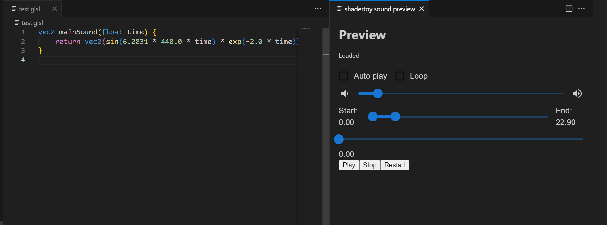

# vscode-shadertoy-sound

With this extension you can run your Shadertoy sound shaders in Visual Studio Code with sound player UI.

## Commands

- `ShaderToy-Sound: Preview` - Run the current sound shader. I highly recommend to add a keybinding for this command.
- `ShaderToy-Sound: Dispose Preview` - Dispose the current Player webview. You can reset thr webview if you have any problem with the player.

